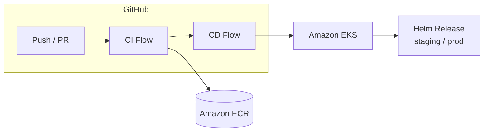

# devsecops-pipeline-demo

[](https://github.com/edsuarezs/devsecops-pipeline-demo/actions/workflows/ci.yml)
[](https://github.com/edsuarezs/devsecops-pipeline-demo/actions/workflows/cd.yml)
[](LICENSE)
[](https://github.com/aquasecurity/trivy)

> Production-grade DevSecOps pipeline for a Go microservice deployed on Amazon EKS.
> Built as a reference implementation covering CI, CD, IaC, and security best practices.

---

## Table of Contents

- [devsecops-pipeline-demo](#devsecops-pipeline-demo)
  - [Table of Contents](#table-of-contents)
  - [Architecture](#architecture)
  - [Tech Stack](#tech-stack)
  - [Repository Structure](#repository-structure)
  - [Prerequisites](#prerequisites)
  - [Getting Started](#getting-started)
    - [1. Clone the repository](#1-clone-the-repository)
    - [2. Run the app locally](#2-run-the-app-locally)
    - [3. Run tests](#3-run-tests)
    - [4. Build and run with Docker](#4-build-and-run-with-docker)
    - [5. Configure AWS credentials](#5-configure-aws-credentials)
    - [6. Provision infrastructure](#6-provision-infrastructure)
  - [Pipeline Overview](#pipeline-overview)
    - [CI — Triggered on every push and pull request](#ci--triggered-on-every-push-and-pull-request)
    - [CD — Triggered on merge to `main`](#cd--triggered-on-merge-to-main)
  - [Security Controls](#security-controls)
  - [Infrastructure](#infrastructure)
  - [Helm Chart](#helm-chart)
  - [Contributing](#contributing)
  - [License](#license)

---

## Architecture



---

## Tech Stack

| Layer                | Tool                         | Purpose                     |
| -------------------- | ---------------------------- | --------------------------- |
| **Application**      | Go 1.23 + Chi                | REST API                    |
| **Containerization** | Docker (multi-stage)         | Image build (~3.7MB)        |
| **Registry**         | Amazon ECR                   | Image storage               |
| **Orchestration**    | Amazon EKS (Kubernetes 1.29) | Container runtime           |
| **IaC**              | Terraform >= 1.7             | Infrastructure provisioning |
| **Packaging**        | Helm 3                       | Kubernetes deployment       |
| **CI/CD**            | GitHub Actions               | Pipeline orchestration      |
| **SAST**             | gosec + Semgrep              | Static code analysis        |
| **Image Scanning**   | Trivy                        | Vulnerability scanning      |
| **Secret Scanning**  | Gitleaks                     | Secrets detection           |
| **SBOM**             | Syft                         | Software Bill of Materials  |

---

## Repository Structure

```
devsecops-pipeline-demo/
├── .github/
│   ├── workflows/
│   │   ├── ci.yml          # Lint, test, SAST, build, push
│   │   └── cd.yml          # Helm deploy, smoke test, rollback
│   └── pull_request_template.md
├── app/                    # Go application
│   ├── main.go             # Entry point + graceful shutdown
│   ├── config/             # 12-factor app settings
│   ├── handlers/           # HTTP handlers + tests
│   ├── middleware/          # Logging + security headers
│   └── models/             # Data models + validation
├── docker/                 # Multi-stage Dockerfile
├── terraform/              # EKS + ECR infrastructure
├── helm/                   # Helm chart (staging + prod)
├── docs/                   # Architecture & runbook
├── .golangci.yml           # Linter configuration
├── .gitignore
├── .pre-commit-config.yaml
├── CHANGELOG.md
└── README.md
```

---

## Prerequisites

| Tool        | Version | Install                                                                      |
| ----------- | ------- | ---------------------------------------------------------------------------- |
| `go`        | >= 1.23 | [go.dev](https://go.dev/dl/)                                                 |
| `docker`    | >= 24.0 | [docs.docker.com](https://docs.docker.com/get-docker/)                       |
| `terraform` | >= 1.7  | [developer.hashicorp.com](https://developer.hashicorp.com/terraform/install) |
| `helm`      | >= 3.14 | [helm.sh](https://helm.sh/docs/intro/install/)                               |
| `kubectl`   | >= 1.29 | [kubernetes.io](https://kubernetes.io/docs/tasks/tools/)                     |
| `aws-cli`   | >= 2.15 | [aws.amazon.com](https://aws.amazon.com/cli/)                                |

---

## Getting Started

### 1. Clone the repository

```bash
git clone git@github.com:edsuarezs/devsecops-pipeline-demo.git
cd devsecops-pipeline-demo
```

### 2. Run the app locally

```bash
cd app
go mod tidy
go run .
# API available at http://localhost:8080
# Health check at http://localhost:8080/healthz
# Readiness check at http://localhost:8080/readyz
# API docs: POST/GET/DELETE http://localhost:8080/api/v1/items/
```

### 3. Run tests

```bash
cd app
go test ./... -v -coverprofile=coverage.out
go tool cover -func=coverage.out
```

### 4. Build and run with Docker

```bash
docker build -f docker/Dockerfile -t devsecops-pipeline-demo:local .
docker run -p 8080:8080 devsecops-pipeline-demo:local
```

### 5. Configure AWS credentials

```bash
aws configure
# AWS Access Key ID:
# AWS Secret Access Key:
# Default region: us-east-1
```

### 6. Provision infrastructure

```bash
cd terraform
cp terraform.tfvars.example terraform.tfvars
# Edit terraform.tfvars with your values
terraform init
terraform plan
terraform apply
```

---

## Pipeline Overview

### CI — Triggered on every push and pull request

```
Checkout → Lint (golangci-lint) → Test (go test) → SAST (gosec + Semgrep)
→ Secret Scan (Gitleaks) → Docker Build → Image Scan (Trivy)
→ Push to ECR
```

### CD — Triggered on merge to `main`

```
Checkout → Configure AWS → Helm Lint → Helm Diff
→ Deploy to Staging → Smoke Test → Deploy to Prod
→ Notify (on success or failure)
```

---

## Security Controls

| Control          | Tool                        | Stage          |
| ---------------- | --------------------------- | -------------- |
| Secret detection | Gitleaks                    | CI — pre-push  |
| Static analysis  | gosec + Semgrep             | CI             |
| Dependency audit | `go mod verify`             | CI             |
| Image scanning   | Trivy (CRITICAL block)      | CI             |
| SBOM generation  | Syft                        | CI             |
| Body size limit  | `http.MaxBytesReader` (1MB) | Application    |
| Security headers | OWASP middleware            | Application    |
| Least privilege  | IAM roles + IRSA            | Infrastructure |
| Network policies | Kubernetes NetworkPolicy    | Helm chart     |

---

## Infrastructure

Managed with Terraform. See [`terraform/`](terraform/) for full details.

- **EKS cluster** — managed node group, private subnets
- **ECR repository** — image scanning enabled, lifecycle policy
- **IAM** — IRSA (IAM Roles for Service Accounts), least privilege
- **VPC** — dedicated VPC, public/private subnets, NAT gateway

---

## Helm Chart

Two environment overlays:

```bash
# Staging
helm upgrade --install devsecops-pipeline-demo ./helm/devsecops-pipeline-demo \
  -f helm/devsecops-pipeline-demo/values-staging.yaml \
  --namespace staging

# Production
helm upgrade --install devsecops-pipeline-demo ./helm/devsecops-pipeline-demo \
  -f helm/devsecops-pipeline-demo/values-prod.yaml \
  --namespace prod
```

---

## Contributing

1. Fork the repository
2. Create a feature branch: `git checkout -b feat/your-feature`
3. Commit using Conventional Commits: `feat:`, `fix:`, `docs:`, `chore:`
4. Open a Pull Request — the CI pipeline runs automatically

---

## License

MIT License — see [LICENSE](LICENSE) for details.
